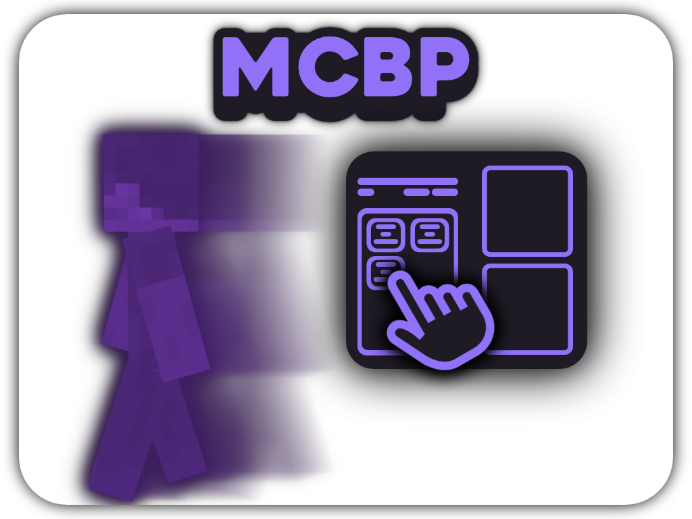

# Minecraft Bot Panel

  

GUI-based Minecraft bot manager with custom script creation.  
Supports Microsoft logins.

> [!NOTE]
> MCBP is still in Beta version.  
> 

## Contents

- [**Features**](#features)
- [**Default Scripts**](#default-scripts)
- [**Documentation**](#documentation)
- [**Script Library**](#script-library)
- [**Theme/CSS Library**](#themecss-library)

### Features

- Custom Script Injection
- Live chat preview
- Script's logs in special panel
- Prebuilt scripts
- User-friendly UI
- Dark mode

### Default Scripts

| Script       | Options                                  | Description                                                     |
| ------------ | ---------------------------------------- | --------------------------------------------------------------- |
| **AntiAFK**  | `Jump`, `Move`, `Rotate`, `Sneak`        | _Prevents server from kicking bot by executing selected action_ |
| **ClearInv** | `Repeat`                                 | _Throws stacks of items from bot's inventory_                   |
| **Follow**   | `Repeat`, `Player Name`, `Delay`         | _Goes to given player's position_                               |
| **GoTo**     | `Repeat`, `X`, `Y`, `Z`                  | _Goes to given coordinates_                                     |
| **Mine**     | `Repeat`, `Block ID`                     | _Finds, goes and mines given block_                             |
| **Spam**     | `Repeat`, `AntiKick`, `Message`, `Delay` | _Sends messages_                                                |

### Documentation

Coming soon...

### Script Library

Coming soon...

### Theme/CSS Library

Coming soon...
